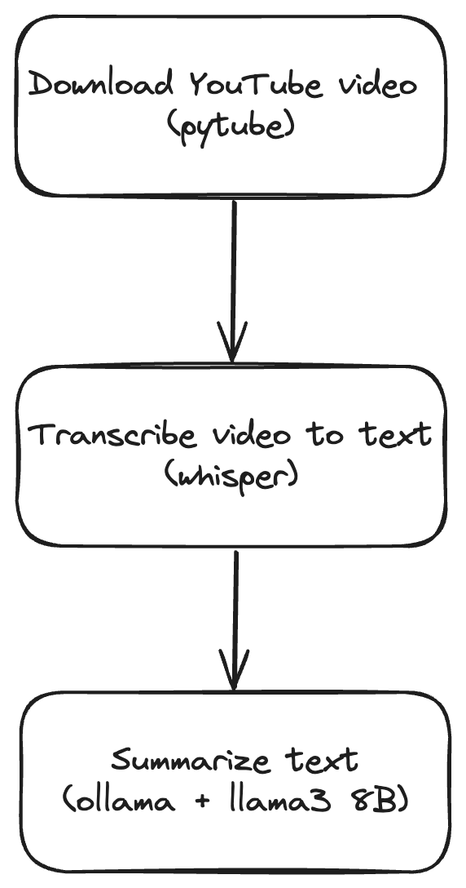

Estimated read time: 5 minutes

## Problem

I personally subscribe to many educational channels on YouTube and every day there are so many new videos to watch.
While I appreciate the authors putting out long-form videos,
it's really hard for me to watch them all and internalize the knowledge,
even if I try to increase the playback speed and multitask.
I just want to be able to extract and learn the gist of the YouTube videos without staring at the screen for hours.

## Idea

I have been playing around with Large Language Models (LLMs) and thought I could build a small app to summarize YouTube videos.
There are already some YouTube video summarizers out there but I want something that is completely free (in both speech and beer) and gives me better privacy.
I call this project "TL;DW" (Too long; didn't watch).

## Tech stack

Since this is just a side project, I would like to keep it simple and avoid any frameworks (nothing against LLM frameworks, though) using just Python and some libraries.
I will use Ollama for running LLMs locally.

## High level flow



Here's the high-level flow of the YouTube summarizer.
We first download a YouTube video with Pytube.
Then we transcribe the downloaded video to text.
Lastly, we summarize the text using an LLM model that runs locally with Ollama.
After the initial setup, except for the YouTube video downloading part, everything else should run locally.

## Pre-requisites

Install [Ollama](https://ollama.com/download) on your machine.

I use OpenAI's [Whisper](https://github.com/openai/whisper) for transcribing videos.
It requires the command line tool `ffmpeg` to be installed.
I am using macOS Sonoma on an Apple Silicon (M1 Pro) chip so I installed it with my favorite package manager, `brew`.

```sh
brew install ffmpeg
```

If you don't use macOS, you can find the command for the different mainstream operating systems and package managers
in the Github [README](https://github.com/openai/whisper?tab=readme-ov-file#setup).

## Python packages

Here's my requirements.txt.

```text
ollama
openai-whisper
pytube
rich
```

I have mentioned all these packages earlier except [rich](https://rich.readthedocs.io/en/latest/) which adds beautiful output formatting and I like it better than Python's built-in Pretty Print.

Install the dependencies:

```sh
pip install -r requirements.txt
```

## Import statements

As with any non-trivial Python code, we need to import some types that we will use later on:

```python
from pytube import YouTube
from rich import print
import whisper
```

## Download a YouTube video

Next we will download a YouTube video with Pytube.
The code is pretty self-explanatory.
By default, Pytube will set the download filename.
We could extract the output filename but for simplicity's sake
we will explicitly set the output filename
so that we can easily load the filename into the transcriber later.

```python
youtube_link = "https://www.youtube.com/watch?v=fqVLjtvWgq8" # Andrej Karpathy on Why you should work on AI agents
output_filename = "video.mp4" # you can name this anything you want

# Download a mp4 version of the video
YouTube(youtube_link).streams.filter(
    progressive=True, file_extension="mp4"
).first().download(filename=output_filename)
```

## Transcribe the downloaded video

Whisper really makes it very easy to transcribe a video.
Here I'm using the base model.
You can refer to https://github.com/openai/whisper?tab=readme-ov-file#available-models-and-languages
for the list of available models.
Generally the bigger the model the faster the transcription but you will need more VRAM.

```python
model = whisper.load_model("base")
result = model.transcribe(output_filename)
print(result["text"])
```

Depending on the video length, this may take a while to run.
The YouTube video above is 6 minutes and 30 seconds long
and the transcription took about 40 seconds on my local machine.

## Summarize the transcript

Ollama is not an LLM per se.
It is a piece of software that lets you run LLMs locally.
Therefore you will need to pull a model before you can start using it for generation.

You can find all the models supported by Ollama at https://ollama.com/library.
I generally use 7B or 8B models (ie. models with 7 or 8 billion parameters) on my local machine.
You can experiment with the bigger models if you have better GPUs with more VRAMs.
At the time of writing (June 2024),
here are some of the most popular open 7B/8B LLMs (in no particular order):-

1. Meta's Llama 3 8B
1. Mistral AI's Mistral 7B
1. Alibaba's Qwen 2 7B
1. Google's Gemma 7B

Let's use Meta's Llama 3 8B (you can easily substitute it with your favorite LLM).
You can pull the model either using the ollama CLI:

```sh
ollama pull llama3
```

Meta's Llama 3 comes with 8B and 70B models and unfortunately my MacBook Pro is not powerful enough to run a 70B model.
Note that we don't need to specify `8b` in the command because Ollama by default installs the 8b version for `llama3`.

However, I generally prefer to specify the model version to make it explicit and avoid confusion.

```sh
ollama run llama3:8b
```

Alternatively, you can use the Ollama's Python API to pull the model:

```python
import ollama

model_name = 'llama3:8b'
ollama.pull(model_name)
```

My recommendation is to use Ollama CLI if you're just getting started.
Once you need to pull models dynamically, you can then try to use the Ollama Python API for that purpose.

Now that we have the llama3 model on our local machine, we can start using it to generate a summary of the video transcription.

```python
chat = ollama.chat(
  model=model_name,
  messages=[
    {
      'role': 'user',
      'content': 'Summarize the following text in bullet points.\n\n' + result['text']
    }
  ]
)
```

So this is basically asking the llama3 model to summarize the transcription in bullet points.
As you can tell this is just a very simple prompt for demonstration purposes
but the point is now you have the freedom to craft your own prompt.

On my machine it took approximately 25 seconds.

And this is what I got:

```python
print(chat['message']['content'])
```

```
* The speaker was recruited to talk about AI agents, which they have a personal connection to due to an early
project at OpenAI.
* In 2016, the speaker worked on a project called World of Bits, which aimed to create AI agents that could perform
tasks using computers and keyboards. However, the technology wasn't mature enough, and the project didn't yield the
desired results.
* The speaker suggests that the right approach at the time would have been to focus on building language models
instead.
* Today, AI agents are "cool again," but with a different team and approach.
* The speaker thinks that AGI will involve many AI agents working together, rather than just one.
* They also caution that some demos may be easy to build, but turning them into products can take years (e.g.,
self-driving cars, PR).
* The speaker draws inspiration from neuroscience, suggesting that AI agents could benefit from understanding how
the brain works. For example, they propose that AI agents might need a "hippocampus" equivalent to record and
retrieve memories.
* The speaker believes that building AI agents is at the forefront of capability today, with many large labs like
OpenAI focused on other areas (e.g., training methods).
* They conclude by expressing excitement about what people are building and encouraging them to continue pushing
the boundaries.
```

Even with a very simple prompt, I was already able to generate the summary above and I didn't have to watch the video at all.
