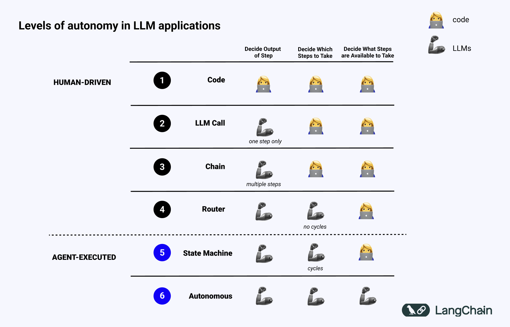

## Understanding AI Agents and Agentic Workflows

My introduction to the concept of "AI agents" began with Reinforcement Learning (RL), a field where agents learn by interacting with and observing their environment to maximize a reward function. Some of the most prominent examples of RL-based AI agents include AlphaGo and self-driving cars.

Despite the success of these applications, developing a reward function that effectively guides RL agents towards their objectives is a significant challenge. Recent advancements in Large Language Models (LLM) and Large Multi-modal Models (LMM) have shifted the focus towards LLM/LMM-powered agents. Lilian Weng from OpenAI provides an excellent overview of LLM-powered agents in her [blog post](https://lilianweng.github.io/posts/2023-06-23-agent/). For further motivation, Andrej Karpathy explained why you should work on AI agents in his [talk](https://www.youtube.com/watch?v=fqVLjtvWgq8).

Andrew Ng offers a compelling analogy for understanding LLMs: generating the next token is like writing an essay in one pass, whereas AI agents iteratively refine the output, similar to multiple drafts of an essay. He elaborates on this in his [talk](https://www.youtube.com/watch?v=sal78ACtGTc). Ng is optimistic about AI agents, as highlighted in his recent [LinkedIn post](https://www.linkedin.com/posts/andrewyng_apples-gen-ai-strategy-stabilitys-copyright-clear-activity-7207059565136236544-9vDg), where he notes a preference for discussing agentic workflows over AI agents due to the reduced likelihood of marketing jargon.

## From Unbounded AI Agents to Bounded Agentic Workflows

The initial surge in popularity for AI agent frameworks such as AutoGPT and BabyAGI, driven by the rise of LLMs, was short-lived. These frameworks struggled with overly general and open-ended tasks, leading to a decline in interest.

In a [latent.space podcast](https://www.latent.space/p/brightwave), Mike Conover of Brightwave articulated the limitations of unbounded agentic behaviors:

> "I don't think that unbounded agentic behaviors are useful. Instead, a useful LLM system is more like a finite state machine where the behavior of the system occupies one of many different behavioral regimes, making decisions about which state to occupy next to achieve the goal."

This perspective underscores the non-deterministic nature of LLM systems, which contrasts with the predictability of traditional coded systems. In real-world applications, reliability is paramount, necessitating controllable AI agents.

## The Spectrum of Autonomy

Langchain illustrates the varying levels of autonomy for AI agents and agentic workflows, emphasizing the importance of controllability and reliability in practical applications.

(source: https://blog.langchain.dev/what-is-an-agent/)

## 2024 is the Year of AI Agents as Finite State Machines and Workflows

As a professional AI engineer, I've been closely following various startups in the AI agent space.
A common trend I've noticed is the modeling of AI agents as Finite State Machines or through more deterministic workflows.
Here are a few notable examples:

- AlphaCodium's [From Prompt Engineering to Flow Engineering](https://www.codium.ai/blog/alphacodium-state-of-the-art-code-generation-for-code-contests/)
- Parcha's [Agents aren't all you need](https://www.parcha.com/blog/agents-arent-all-you-need)
- Gradient Labs's [Building agentic workflows](https://blog.gradient-labs.ai/p/building-agentic-workflows)

Langchain is also heading in this direction, with the launch of [LangGraph Cloud](https://blog.langchain.dev/langgraph-cloud/).
They are actively educating the industry on creating reliable agents.
Lance Martin's presentation on [Building and Testing Reliable Agents](https://www.youtube.com/watch?v=XiySC-d346E) provides excellent insights into these developments --
I wish this was available when I first started out.
